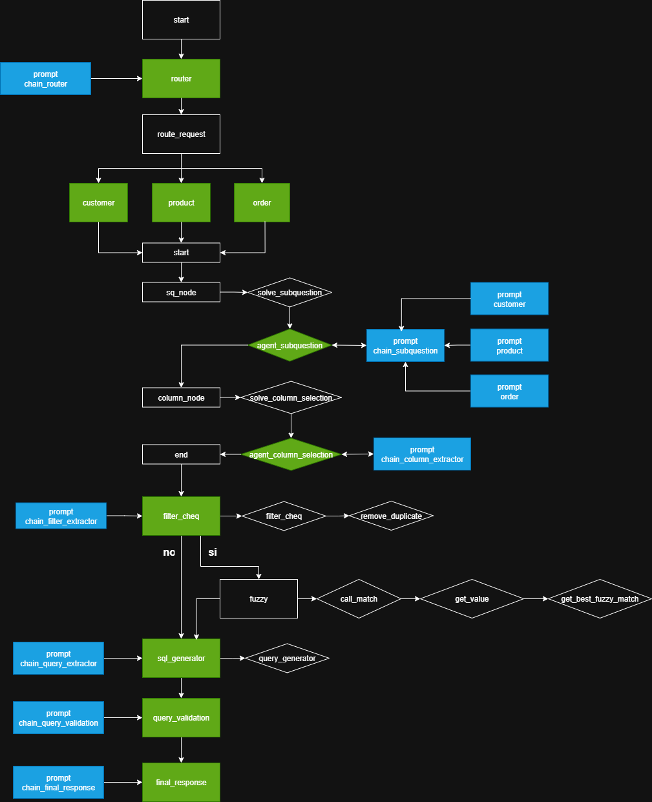
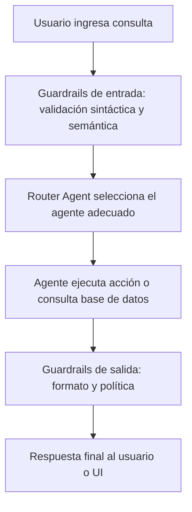

# 🧠  Procesamiento Natural del Lenguaje – Sistema Multiagente con LLM

Este proyecto implementa un sistema de agentes inteligentes que interactúan en lenguaje natural con una base de datos SQLite.
Utiliza LLMs, LangGraph, LangChain y Guardrails para garantizar coherencia y seguridad tanto en la entrada como en la salida de las consultas.
La arquitectura se compone de agentes especializados que cooperan para interpretar, ejecutar y validar consultas de forma autónoma.
Además, el sistema incluye un módulo de notificaciones multicanal, permitiendo enviar resultados por Email, Slack o Telegram.

---

## 📂 Estructura del proyecto

- **`src/agents/`** → Agentes especializados por dominio (clientes, productos, pedidos, SQL, etc.).  
- **`src/core/`** → Núcleo del sistema: base de datos, logs, validaciones (Guardrails) y utilidades comunes.  
- **`src/knowledge/`** → Generador y almacenamiento de conocimiento contextual para los agentes.  
- **`src/notifications/`** → Módulos de notificación por email, Slack y Telegram.  
- **`src/workflows/`** → Orquestación de agentes mediante *LangGraph*.  
- **`templates/`** → Prompts y configuraciones YAML generales y específicas por agente.  
- **`config/`** → Parámetros del sistema, definición de agentes y estructura de tablas.  
- **`data/`** → Base de datos local y scripts para generar datos de prueba.  
- **`interfaces/`** → Interfaz web en Streamlit para consultas y control del sistema.  
- **`logs/`** → Registros de ejecución y métricas del sistema.  
- **`docs/`** → Diagramas y documentación técnica adicional.  


```
.
├── main.py
├── main_kl_generator.py
├── main_streamlit.py
├── README.md
├── .env
├── config/
│   ├── agents.yaml
│   ├── system.yaml
│   └── tables.yaml
├── data/
│   ├── db/
│   │   └── fake_db.sqlite
│   └── scripts/
│       └── fake_db_generator.py
├── docs/
│   └── Diagram.drawio
├── logs/
│   └── aige.log
├── src/
│   ├── agents/
│   │   ├── base_agent.py
│   │   ├── customer_agent.py
│   │   ├── execute_sql_agent.py
│   │   ├── filter_check_agent.py
│   │   ├── ... (otros agentes)
│   ├── core/
│   │   ├── database/
│   │   │   └── local_db.py
│   │   └── guardrails/
│   │   │   ├── base_guard.py
│   │   │   ├── input_guard.py
│   │   │   └── output_guard.py
│   │   ├── logging/
│   │   │   └── logger_config.py
│   │   └── utils/
│   │       ├── engine_loader.py
│   │       ├── llm_loader.py
│   │       ├── template_loader.py
│   │       └── ... (otros utils)
│   ├── knowledge/
│   │   ├── kb_generator.py
│   │   └── knowledge.json
│   ├── notifications/
│   │   ├── email_notifier.py
│   │   ├── slack_notifier.py
│   │   └── telegram_notifier.py
│   └── workflows/
│       └── build_graph.py
├── templates/
│   ├── general/
│   │   ├── column_extractor.yaml
│   │   ├── knowledge.yaml
│   │   ├── query_generation.yaml
│   │   └── ... (otros templates)
│   └── specific/
│       ├── customer.yaml
│       ├── orders.yaml
│       └── product.yaml
└── interfaces/
        └── streamlit_app.py

```

---

## ⚙️ Requisitos

* Python 3.10+
* [LangChain / LangGraph](https://www.langchain.com/)
* [SQLAlchemy](https://www.sqlalchemy.org/)
* [Faker](https://faker.readthedocs.io/)
* [PyYAML](https://pyyaml.org/)
* Una API key para el proveedor LLM (configurada en `.env`)

Instalar dependencias:

```bash
pip install -r requirements.txt
```

---


## 🛠️ Configuración

* `config/tables.yaml` → Define las tablas, nombres lógicos y columnas.
* `config/agents.yaml` → Define los agentes y su comportamiento.
* `config/system.yaml` → Configuración global del sistema.
* `.env` → Contiene las credenciales de LLM, correo, Slack y Telegram:

---

🏗️ Arquitectura del sistema

La siguiente figura muestra la arquitectura multiagente implementada:



* Cada agente tiene responsabilidades específicas (SQL, filtrado, respuesta final, notificaciones).

* Los agentes cooperan mediante un grafo de flujo de información gestionado por LangGraph.

---

## ▶️ Uso

1. **Configurar variables de entorno** en `.env` (ejemplo: clave del modelo LLM, configuración de DB).
2. **Generar la base fake**:

```bash
python data/scripts/fake_db_generator.py
```

3. **Generar base de conocimiento (KB)**:

```bash
python main_kl_generator.py
```

4. **Ejecutar el sistema principal en terminal**:

```bash
python main.py
```

5. **Ejecutar el sistema principal con streamlit**:

```bash
streamlit run main_streamlit.py
```

---

## 📖 Documentación

* `docs/Diagram.drawio` → Diagrama de arquitectura.

---

## 🔄 Flujo de notificaciones

El agente final combina **el canal de notificación configurado por defecto en system.yaml** con **los canales mencionados explícitamente por el usuario**: Email, Slack o Telegram. Si el usuario menciona un canal en su consulta, la notificación **se suma al canal configurado**. Los mensajes incluyen siempre una introducción automática del sistema de agentes.

---

## 🛡️ Validación y seguridad

El sistema incorpora validaciones en dos niveles, implementadas con **Guardrails-AI** para asegurar interacciones seguras y estructuradas entre el usuario y los agentes:

1. **Validación de entrada (input guardrails):**  
   Antes de procesar la pregunta del usuario, el sistema valida su estructura, contenido y tipo.  
   Esto previene inyecciones de prompt, entradas maliciosas o consultas fuera del contexto permitido.  
   Esta capa se encuentra implementada tanto en:
   - `main.py` (modo CLI / API)
   - `main_streamlit.py` (modo interfaz visual)

2. **Validación de salida (output guardrails):**  
   Todas las respuestas generadas por los agentes pasan por un verificador de formato semántico.  
   Esto garantiza que los resultados sean **interpretables, verificables y seguros** antes de mostrarse al usuario.


#### Flujo de validación con Guardrails



---

## 📜 Logs y pruebas

Los eventos del sistema se almacenan automáticamente en el archivo: `logs/aige.log`.

Este archivo registra el flujo completo de interacción, incluyendo:

- Consultas recibidas por el agente
- Respuestas generadas
- Uso de tokens por componente (prompt, completion, total)
- Tiempos de ejecución (`elapsed`)
- Cantidad de caracteres de entrada y salida
- Validaciones realizadas por Guardrails

Ejemplo de contenido del log

```text
Recibido: User: me das el id del mayor pedido?
Devuelto: me das el id del mayor pedido?

2025-10-06 23:37:32,936 - INFO - tokens - [router] prompt=376, completion=460, total=836 | elapsed=4.12s | in_chars=1727, out_chars=10
2025-10-06 23:38:00,718 - INFO - tokens - [filter_check] prompt=943, completion=652, total=1595 | elapsed=4.51s | in_chars=4008, out_chars=6
2025-10-06 23:38:30,495 - INFO - [Guardrails] Validación exitosa
```
---

✍️ Autores: **Jonathan Cagua y Juan Pablo Alianak**
