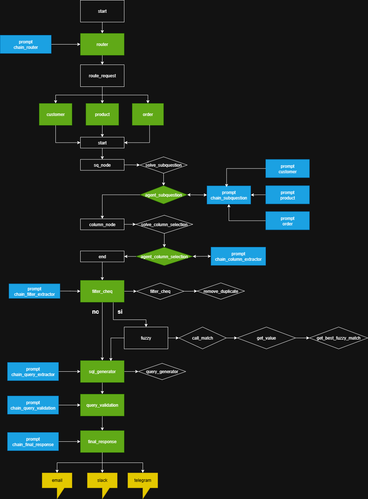

# 🧠 Procesamiento Natural del Lenguaje – Sistema Multiagente con LLM

Este proyecto implementa un **sistema de agentes inteligentes** que interactúan con lenguaje natural con una base de datos SQlite. Se utilizan **LLMs**, **LangGraph**, **LangChain**, y una arquitectura de agentes especializados que cooperan para responder consultas.

---

## 📂 Estructura del proyecto

```
.
├── main.py
├── main_kl_generator.py
├── main_streamlit.py
├── README.md
├── .env
├── config/
│   ├── agents.yaml
│   ├── system.yaml
│   └── tables.yaml
├── data/
│   ├── db/
│   │   └── fake_db.sqlite
│   └── scripts/
│       └── fake_db_generator.py
├── docs/
│   └── Diagram.drawio
├── logs/
│   └── aige.log
├── src/
│   ├── agents/
│   │   ├── base_agent.py
│   │   ├── customer_agent.py
│   │   ├── execute_sql_agent.py
│   │   ├── filter_check_agent.py
│   │   ├── ... (otros agentes)
│   ├── core/
│   │   ├── database/
│   │   │   └── local_db.py
│   │   ├── logging/
│   │   │   └── logger_config.py
│   │   └── utils/
│   │       ├── engine_loader.py
│   │       ├── llm_loader.py
│   │       ├── template_loader.py
│   │       └── ... (otros utils)
│   ├── knowledge/
│   │   ├── kb_generator.py
│   │   └── knowledge.json
│   └── workflows/
│       └── build_graph.py
├── templates/
│   ├── general/
│   │   ├── column_extractor.yaml
│   │   ├── knowledge.yaml
│   │   ├── query_generation.yaml
│   │   └── ... (otros templates)
│   └── specific/
│       ├── customer.yaml
│       ├── orders.yaml
│       └── product.yaml
└── interfaces/
        └── streamlit_app.py

```

---

## ⚙️ Requisitos

* Python 3.10+
* [LangChain / LangGraph](https://www.langchain.com/)
* [SQLAlchemy](https://www.sqlalchemy.org/)
* [Faker](https://faker.readthedocs.io/)
* [PyYAML](https://pyyaml.org/)
* Una API key para el proveedor LLM (configurada en `.env`)

Instalar dependencias:

```bash
pip install -r requirements.txt
```

---


## 🛠️ Configuración

* `config/tables.yaml` → Define las tablas, nombres lógicos y columnas.
* `config/agents.yaml` → Define los agentes y su comportamiento.
* `config/system.yaml` → Configuración global del sistema.
* `.env` → Claves y parámetros sensibles.

---

🏗️ Arquitectura del sistema

La siguiente figura muestra la arquitectura multiagente implementada:


---

## ▶️ Uso

1. **Configurar variables de entorno** en `.env` (ejemplo: clave del modelo LLM, configuración de DB).
2. **Generar la base fake**:

```bash
python data/scripts/fake_db_generator.py
```

3. **Generar base de conocimiento (KB)**:

```bash
python main_kl_generator.py
```

4. **Ejecutar el sistema principal**:

```bash
python main.py
```

---

## 📖 Documentación

* `docs/Diagram.drawio` → Diagrama de arquitectura.

---

## 📜 Logs y pruebas

* Los logs se almacenan en `logs/aige.log`.

---

✍️ Autores: **Jonathan Cagua y Juan Pablo Alianak**
